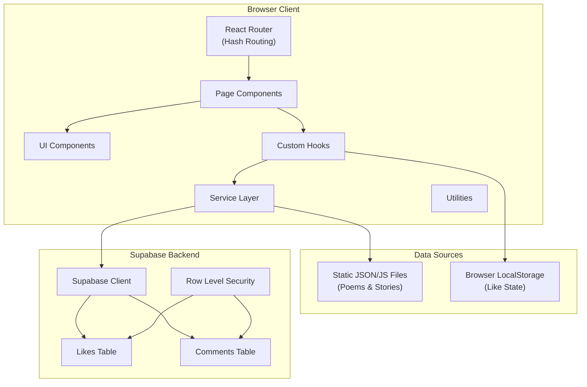
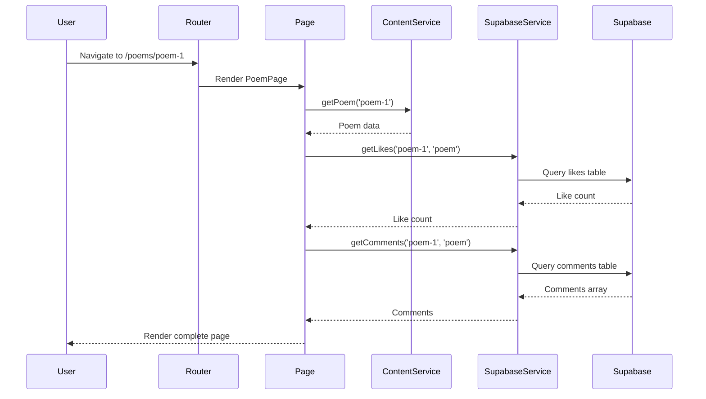

# Technical Design Document

## Overview

This document provides the technical design for a personal poetry and storytelling website. The website delivers an elegant, dark-themed reading experience for poems and stories, with community engagement features powered by Supabase.

### Technology Stack
- **Frontend Framework**: React 18+ with functional components and hooks
- **Build Tool**: Vite for fast development and optimized production builds
- **Routing**: React Router v6 with hash-based routing for GitHub Pages compatibility
- **Styling**: Tailwind CSS with custom dark theme configuration
- **Backend Services**: Supabase for likes and comments persistence
- **Hosting**: GitHub Pages for static site deployment
- **Content Management**: Static JSON/JavaScript data files for poems and stories

### Key Design Decisions

1. **Hash Routing over Browser History API**: GitHub Pages doesn't support server-side routing rewrites, so hash routing (`/#/poems`) ensures client-side routing works correctly without 404.html workarounds.

2. **Local Storage for Like State**: Browser local storage tracks whether a user has liked content, preventing duplicate likes without requiring authentication.

3. **Static Content with Dynamic Engagement**: Poems and stories are bundled as static data at build time for fast loading, while likes and comments are fetched from Supabase at runtime.

4. **Mobile-First Responsive Grid**: CSS breakpoints start from mobile (320px) and scale up, ensuring optimal experience on smaller devices first.

5. **Optimistic UI Updates**: Like counts update immediately on user interaction, with server sync happening asynchronously for perceived performance.

## Architecture

### High-Level Architecture Diagram



### Application Flow



### Directory Structure

```
src/
├── assets/                    # Static assets (images, fonts)
├── components/                # Reusable UI components
│   ├── common/               # Generic components (Button, Loading, etc.)
│   ├── content/              # Content-specific components (ContentCard, etc.)
│   ├── engagement/           # Like and Comment components
│   └── navigation/           # Navigation components (Navbar, MobileMenu)
├── pages/                    # Page-level components
│   ├── HomePage.jsx
│   ├── PoemsPage.jsx
│   ├── StoriesPage.jsx
│   ├── PoemDetailPage.jsx
│   ├── StoryDetailPage.jsx
│   ├── AboutPage.jsx
│   └── NotFoundPage.jsx
├── layouts/                  # Layout wrapper components
│   └── MainLayout.jsx
├── services/                 # Data fetching and business logic
│   ├── contentService.js     # Poem/Story data operations
│   ├── likeService.js        # Like operations with Supabase
│   └── commentService.js     # Comment operations with Supabase
├── hooks/                    # Custom React hooks
│   ├── useContent.js         # Content fetching hook
│   ├── useLikes.js           # Like state management hook
│   ├── useComments.js        # Comment state management hook
│   └── useReadingTime.js     # Reading time calculation hook
├── utils/                    # Pure utility functions
│   ├── readingTime.js        # Reading time calculator
│   ├── formatDate.js         # Date formatting utilities
│   └── sanitize.js           # Input sanitization utilities
├── lib/                      # External service clients
│   └── supabase.js           # Supabase client initialization
├── data/                     # Static content data
│   ├── poems.js              # Poems data array
│   ├── stories.js            # Stories data array
│   └── about.js              # About page content
├── App.jsx                   # Root application component
├── main.jsx                  # Application entry point
└── index.css                 # Global styles and Tailwind imports
```

## Components and Interfaces

### Core Components

#### MainLayout
Wrapper component providing consistent page structure.

```typescript
interface MainLayoutProps {
  children: React.ReactNode;
}

// Provides: Navigation header, main content area, footer
// Manages: Mobile menu state, scroll behavior
```

#### Navbar
Primary navigation component with responsive behavior.

```typescript
interface NavbarProps {
  currentPath: string;
}

// Desktop: Full horizontal navigation links
// Mobile: Hamburger menu with expandable navigation
// Highlights active route
```

#### MobileMenu
Expandable navigation menu for mobile viewports.

```typescript
interface MobileMenuProps {
  isOpen: boolean;
  onClose: () => void;
  currentPath: string;
}

// Animated slide-in menu
// Closes on navigation or outside click
// Traps focus for accessibility
```

#### ContentCard
Reusable card component for poem/story previews.

```typescript
interface ContentCardProps {
  id: string;
  type: 'poem' | 'story';
  title: string;
  excerpt: string;
  publicationDate: string;
  readingTime: number;
  onClick?: () => void;
}

// Displays: Title, excerpt, date, reading time
// Handles: Click navigation, hover states
// Responsive: Single/multi-column grid layouts
```

#### LikeButton
Interactive like component with optimistic updates.

```typescript
interface LikeButtonProps {
  contentId: string;
  contentType: 'poem' | 'story';
  initialCount: number;
}

// Features: Toggle like/unlike, animated feedback
// State: Tracks liked status via localStorage
// Fallback: Disabled state when Supabase unavailable
```

#### CommentSection
Comment display and submission component.

```typescript
interface CommentSectionProps {
  contentId: string;
  contentType: 'poem' | 'story';
}

// Displays: Existing comments with author, text, timestamp
// Form: Display name and comment text inputs
// Validation: Required fields, sanitized input
// Error handling: Preserves input on submission failure
```

#### LoadingSpinner
Consistent loading indicator component.

```typescript
interface LoadingSpinnerProps {
  size?: 'small' | 'medium' | 'large';
  message?: string;
}

// Animated spinner with optional loading message
// Used during Supabase data fetching
```

#### EmptyState
Friendly empty state for listing pages.

```typescript
interface EmptyStateProps {
  title: string;
  message: string;
  icon?: React.ReactNode;
}

// Displayed when no poems/stories exist
// Maintains visual consistency with theme
```

### Page Components

#### HomePage
Landing page with hero and featured content.

```typescript
// Sections: Hero, Featured Poems, Featured Stories
// Data: Fetches latest/featured content from ContentService
// Navigation: Links to individual content pages
```

#### PoemsPage
Listing page for all poems.

```typescript
// Layout: Responsive grid of ContentCards
// Sorting: Reverse chronological by default
// Empty state: Friendly message when no poems
```

#### StoriesPage
Listing page for all stories.

```typescript
// Layout: Responsive grid of ContentCards
// Sorting: Reverse chronological by default
// Empty state: Friendly message when no stories
```

#### PoemDetailPage
Individual poem display page.

```typescript
// Content: Full poem with preserved formatting
// Metadata: Title, author, date, reading time
// Engagement: LikeButton and CommentSection
// Error: 404 redirect for non-existent poems
```

#### StoryDetailPage
Individual story display page.

```typescript
// Content: Full story with typography optimization
// Metadata: Title, author, date, reading time
// Engagement: LikeButton and CommentSection
// Error: 404 or access-restricted message as appropriate
```

#### AboutPage
Author biography and contact information.

```typescript
// Content: Bio, profile image, social links
// Data: Loaded from static data file
// Styling: Consistent with site theme
```

#### NotFoundPage
404 error page.

```typescript
// Content: Friendly error message
// Navigation: Link to return home
// Styling: Maintains dark theme
```

### Service Interfaces

#### ContentService

```typescript
interface ContentService {
  // Poem operations
  getAllPoems(): Poem[];
  getPoemById(id: string): Poem | null;
  getFeaturedPoems(limit?: number): Poem[];
  
  // Story operations
  getAllStories(): Story[];
  getStoryById(id: string): Story | null;
  getFeaturedStories(limit?: number): Story[];
  
  // Filtering (for future extensibility)
  filterByTags(items: Content[], tags: string[]): Content[];
}
```

#### LikeService

```typescript
interface LikeService {
  getLikeCount(contentId: string, contentType: ContentType): Promise<number>;
  incrementLike(contentId: string, contentType: ContentType): Promise<number>;
  decrementLike(contentId: string, contentType: ContentType): Promise<number>;
  isLiked(contentId: string): boolean;  // From localStorage
  setLiked(contentId: string, liked: boolean): void;  // To localStorage
}
```

#### CommentService

```typescript
interface CommentService {
  getComments(contentId: string, contentType: ContentType): Promise<Comment[]>;
  addComment(
    contentId: string,
    contentType: ContentType,
    authorName: string,
    commentText: string
  ): Promise<Comment>;
}

interface Comment {
  id: string;
  content_id: string;
  content_type: ContentType;
  author_name: string;
  comment_text: string;
  created_at: string;
}
```

### Custom Hooks

#### useContent

```typescript
function useContent(type: 'poem' | 'story', id?: string) {
  // Returns: { data, loading, error }
  // Fetches single item or list based on id presence
}
```

#### useLikes

```typescript
function useLikes(contentId: string, contentType: ContentType) {
  // Returns: { count, isLiked, toggleLike, loading, error }
  // Manages optimistic updates and localStorage sync
}
```

#### useComments

```typescript
function useComments(contentId: string, contentType: ContentType) {
  // Returns: { comments, addComment, loading, error, submitError }
  // Handles comment fetching and submission
}
```

#### useReadingTime

```typescript
function useReadingTime(content: string) {
  // Returns: number (minutes)
  // Calculates based on word count
}
```

## Data Models

### Content Types

#### Poem

```typescript
interface Poem {
  id: string;              // Unique identifier (URL slug)
  title: string;           // Poem title
  content: string;         // Full poem content (may include Markdown)
  author: string;          // Author name
  publicationDate: string; // ISO date string (YYYY-MM-DD)
  tags?: string[];         // Optional categorization tags
  excerpt?: string;        // Short preview (auto-generated if not provided)
  featured?: boolean;      // Flag for homepage display
}
```

#### Story

```typescript
interface Story {
  id: string;              // Unique identifier (URL slug)
  title: string;           // Story title
  content: string;         // Full story content (may include Markdown)
  author: string;          // Author name
  publicationDate: string; // ISO date string (YYYY-MM-DD)
  tags?: string[];         // Optional categorization tags
  excerpt?: string;        // Short preview (auto-generated if not provided)
  featured?: boolean;      // Flag for homepage display
  status?: 'published' | 'draft' | 'private';  // Content visibility status
}
```

#### About

```typescript
interface AboutData {
  name: string;            // Author's display name
  bio: string;             // Biography text (may include Markdown)
  profileImage: string;    // Path to profile image
  socialLinks: SocialLink[];
}

interface SocialLink {
  platform: string;        // e.g., "Twitter", "Instagram", "Email"
  url: string;            // Link URL or mailto:
  icon?: string;          // Optional icon identifier
}
```

### Supabase Database Schema

#### Likes Table

```sql
CREATE TABLE likes (
  id SERIAL PRIMARY KEY,
  content_id VARCHAR(255) NOT NULL,
  content_type VARCHAR(50) NOT NULL CHECK (content_type IN ('poem', 'story')),
  count INTEGER DEFAULT 0,
  created_at TIMESTAMP WITH TIME ZONE DEFAULT NOW(),
  updated_at TIMESTAMP WITH TIME ZONE DEFAULT NOW(),
  UNIQUE(content_id, content_type)
);

-- Row Level Security
ALTER TABLE likes ENABLE ROW LEVEL SECURITY;

-- Allow anonymous reads
CREATE POLICY "Allow anonymous reads" ON likes
  FOR SELECT USING (true);

-- Allow anonymous updates (for incrementing/decrementing)
CREATE POLICY "Allow anonymous updates" ON likes
  FOR UPDATE USING (true);

-- Allow anonymous inserts (for first like)
CREATE POLICY "Allow anonymous inserts" ON likes
  FOR INSERT WITH CHECK (true);
```

#### Comments Table

```sql
CREATE TABLE comments (
  id UUID DEFAULT gen_random_uuid() PRIMARY KEY,
  content_id VARCHAR(255) NOT NULL,
  content_type VARCHAR(50) NOT NULL CHECK (content_type IN ('poem', 'story')),
  author_name VARCHAR(100) NOT NULL,
  comment_text TEXT NOT NULL,
  created_at TIMESTAMP WITH TIME ZONE DEFAULT NOW(),
  
  -- Constraints
  CONSTRAINT comment_text_not_empty CHECK (char_length(trim(comment_text)) > 0),
  CONSTRAINT author_name_not_empty CHECK (char_length(trim(author_name)) > 0)
);

-- Index for efficient content queries
CREATE INDEX idx_comments_content ON comments(content_id, content_type);

-- Row Level Security
ALTER TABLE comments ENABLE ROW LEVEL SECURITY;

-- Allow anonymous reads
CREATE POLICY "Allow anonymous reads" ON comments
  FOR SELECT USING (true);

-- Allow anonymous inserts
CREATE POLICY "Allow anonymous inserts" ON comments
  FOR INSERT WITH CHECK (true);
```

### Static Data File Format

#### poems.js Example

```javascript
export const poems = [
  {
    id: "whispers-of-dawn",
    title: "Whispers of Dawn",
    content: `In the quiet hours before light,
When stars still cling to fading night,
I hear the whispers soft and clear—
A new day's promise drawing near.

The sky blushes pink, then gold,
As stories of the sun unfold.`,
    author: "Pratima",
    publicationDate: "2024-01-15",
    tags: ["nature", "hope"],
    featured: true
  },
  // ... more poems
];
```

#### stories.js Example

```javascript
export const stories = [
  {
    id: "the-lighthouse-keeper",
    title: "The Lighthouse Keeper",
    content: `The lighthouse had stood for a hundred years...`,
    author: "Pratima",
    publicationDate: "2024-01-20",
    tags: ["fiction", "solitude"],
    excerpt: "A tale of solitude, purpose, and the light that guides us home.",
    featured: true,
    status: "published"
  },
  // ... more stories
];
```

### LocalStorage Schema

```typescript
// Like state storage
interface LikeStorage {
  [key: string]: boolean;  // key format: "{contentType}:{contentId}"
}

// Example:
// localStorage.setItem('likes', JSON.stringify({
//   "poem:whispers-of-dawn": true,
//   "story:the-lighthouse-keeper": false
// }));
```

### Environment Variables

```bash
# .env.local (not committed to repository)
VITE_SUPABASE_URL=https://your-project.supabase.co
VITE_SUPABASE_ANON_KEY=your-anon-key-here

# Note: Never use service role key in client-side code
```


## Correctness Properties

*A property is a characteristic or behavior that should hold true across all valid executions of a system—essentially, a formal statement about what the system should do. Properties serve as the bridge between human-readable specifications and machine-verifiable correctness guarantees.*

The following properties apply to the pure utility functions and data transformation logic in this feature. UI rendering, responsive layouts, and Supabase integration are tested through example-based and integration tests rather than property-based tests.

### Property 1: Reading Time Calculation Correctness

*For any* content string, the `calculateReadingTime` function SHALL return a positive integer representing minutes, calculated as `max(1, Math.round(wordCount / 200))`, where word count is determined by splitting on whitespace.

**Validates: Requirements 11.1, 11.2, 11.3**

### Property 2: Chronological Sorting Preserves Order Invariant

*For any* array of content items (poems, stories, or comments) with date/timestamp fields, after sorting in reverse chronological order, each item's date SHALL be greater than or equal to the next item's date in the resulting array.

**Validates: Requirements 3.5, 4.5, 10.6**

### Property 3: Content Card Rendering Completeness

*For any* valid poem or story object, when rendered as a ContentCard, the resulting output SHALL contain the title, a non-empty excerpt (either provided or auto-generated from content), and a formatted publication date string.

**Validates: Requirements 3.2, 4.2**

### Property 4: Poem Formatting Preservation

*For any* poem content string containing newline characters (`\n`), when rendered for display, the output SHALL preserve the line structure by including corresponding HTML break elements (`<br>`) or paragraph/div separations for each newline sequence.

**Validates: Requirements 5.4**

### Property 5: Comment Validation Rejects Invalid Input

*For any* comment submission where the author name is empty/whitespace-only OR the comment text is empty/whitespace-only, the validation function SHALL return a failure result and prevent submission.

**Validates: Requirements 10.4, 10.5**

### Property 6: Input Sanitization Prevents Script Injection

*For any* input string containing HTML script tags (`<script>`), event handlers (`onclick`, `onerror`, etc.), or javascript: URLs, the `sanitize` function SHALL return a string that does not contain any executable JavaScript when rendered as HTML.

**Validates: Requirements 10.9**

### Property 7: Content Data Structure Validation

*For any* content item (poem or story) in the data source, it SHALL have the following required fields present and non-empty: `id` (string), `title` (string), `content` (string), `author` (string), and `publicationDate` (valid ISO date string).

**Validates: Requirements 15.3, 15.4**

### Property 8: Tag Filtering Returns Only Matching Content

*For any* content array and tag filter string, the `filterByTags` function SHALL return a subset containing only items where the item's `tags` array includes the filter tag. The result length SHALL be less than or equal to the input length.

**Validates: Requirements 20.5**

## Error Handling

### Network and Supabase Errors

| Error Scenario | Handling Strategy | User Experience |
|----------------|-------------------|-----------------|
| Supabase connection failure | Catch error, use cached/default values | Like button disabled, cached count shown |
| Comment save failure | Catch error, retain form data | Error message displayed, form data preserved |
| Slow network response | Implement timeout (10s) | Loading indicator, then timeout message |
| Invalid Supabase response | Validate response shape | Fallback to default state |

### Content Errors

| Error Scenario | Handling Strategy | User Experience |
|----------------|-------------------|-----------------|
| Non-existent poem/story ID | Check existence before render | Redirect to 404 page |
| Restricted/private content | Check status field | Show access-restricted message |
| Malformed content data | Validate on load, skip invalid | Log warning, exclude from lists |
| Empty content arrays | Check length before map | Show friendly empty state |

### Input Validation Errors

| Error Scenario | Handling Strategy | User Experience |
|----------------|-------------------|-----------------|
| Empty comment submission | Client-side validation | Inline error message, form not submitted |
| Empty author name | Client-side validation | Inline error message, form not submitted |
| XSS attempt in comment | Sanitize before save/display | Sanitized content saved, no script execution |
| Extremely long input | Truncate at reasonable limit (5000 chars) | Truncated content saved |

### Navigation Errors

| Error Scenario | Handling Strategy | User Experience |
|----------------|-------------------|-----------------|
| Invalid route | React Router catch-all route | 404 page displayed |
| Navigation during loading | Cancel pending requests | Clean transition to new page |
| Hash routing edge cases | Use `HashRouter` consistently | Correct routing behavior |

### Error Boundary Implementation

```typescript
// Top-level error boundary for unexpected React errors
interface ErrorBoundaryState {
  hasError: boolean;
  error: Error | null;
}

// Catches: Render errors, lifecycle errors, errors in child components
// Does NOT catch: Event handlers, async code, server-side rendering errors
// Recovery: Shows friendly error message with "Return to Home" link
```

### Graceful Degradation Strategy

1. **Likes System Failure**: Display cached like count (or 0), disable interaction
2. **Comments System Failure**: Show "Comments unavailable" message, hide form
3. **Content Load Failure**: Show error message with retry option
4. **Image Load Failure**: Show placeholder with alt text

## Testing Strategy

### Testing Approach Overview

This feature uses a dual testing approach:
- **Property-Based Tests**: For pure utility functions with universal properties (8 properties identified)
- **Example-Based Unit Tests**: For specific scenarios, UI components, and edge cases
- **Integration Tests**: For Supabase interactions and routing behavior
- **Accessibility Tests**: For WCAG compliance verification

### Property-Based Testing Configuration

**Library**: fast-check (JavaScript property-based testing library)

**Configuration Requirements**:
- Minimum 100 iterations per property test
- Seed logging for reproducibility
- Shrinking enabled for minimal failing cases

**Test Tagging Format**:
```javascript
// Feature: poetry-storytelling-website, Property 1: Reading Time Calculation Correctness
test.prop([fc.string()], (content) => {
  // Property implementation
});
```

### Property Test Implementations

#### Property 1: Reading Time Calculation

```javascript
// Feature: poetry-storytelling-website, Property 1: Reading Time Calculation Correctness
describe('calculateReadingTime', () => {
  it('returns correct minutes for any content', () => {
    fc.assert(
      fc.property(fc.string(), (content) => {
        const result = calculateReadingTime(content);
        const wordCount = content.trim().split(/\s+/).filter(Boolean).length;
        const expected = Math.max(1, Math.round(wordCount / 200));
        return result === expected && result >= 1 && Number.isInteger(result);
      }),
      { numRuns: 100 }
    );
  });
});
```

#### Property 2: Chronological Sorting

```javascript
// Feature: poetry-storytelling-website, Property 2: Chronological Sorting Preserves Order Invariant
describe('sortByDate', () => {
  it('maintains reverse chronological order for any date array', () => {
    fc.assert(
      fc.property(
        fc.array(fc.record({ date: fc.date() })),
        (items) => {
          const sorted = sortByDateDescending(items);
          for (let i = 0; i < sorted.length - 1; i++) {
            if (sorted[i].date < sorted[i + 1].date) return false;
          }
          return true;
        }
      ),
      { numRuns: 100 }
    );
  });
});
```

#### Property 5: Comment Validation

```javascript
// Feature: poetry-storytelling-website, Property 5: Comment Validation Rejects Invalid Input
describe('validateComment', () => {
  it('rejects empty or whitespace-only inputs', () => {
    fc.assert(
      fc.property(
        fc.oneof(
          fc.record({ authorName: fc.constant(''), commentText: fc.string() }),
          fc.record({ authorName: fc.string(), commentText: fc.constant('') }),
          fc.record({ authorName: fc.stringOf(fc.constant(' ')), commentText: fc.string() }),
          fc.record({ authorName: fc.string(), commentText: fc.stringOf(fc.constant(' ')) })
        ),
        ({ authorName, commentText }) => {
          return !validateComment(authorName, commentText).isValid;
        }
      ),
      { numRuns: 100 }
    );
  });
});
```

#### Property 6: Input Sanitization

```javascript
// Feature: poetry-storytelling-website, Property 6: Input Sanitization Prevents Script Injection
describe('sanitize', () => {
  it('removes executable JavaScript from any input', () => {
    fc.assert(
      fc.property(
        fc.oneof(
          fc.constant('<script>alert("xss")</script>'),
          fc.constant(''),
          fc.constant('<a href="javascript:alert(1)">'),
          fc.string().map(s => `<script>${s}</script>`)
        ),
        (maliciousInput) => {
          const sanitized = sanitize(maliciousInput);
          return !sanitized.includes('<script') &&
                 !sanitized.includes('onerror') &&
                 !sanitized.includes('javascript:');
        }
      ),
      { numRuns: 100 }
    );
  });
});
```

#### Property 8: Tag Filtering

```javascript
// Feature: poetry-storytelling-website, Property 8: Tag Filtering Returns Only Matching Content
describe('filterByTags', () => {
  it('returns only items containing the specified tag', () => {
    fc.assert(
      fc.property(
        fc.array(fc.record({
          id: fc.string(),
          tags: fc.array(fc.string())
        })),
        fc.string(),
        (items, tag) => {
          const filtered = filterByTags(items, [tag]);
          return filtered.every(item => item.tags.includes(tag)) &&
                 filtered.length <= items.length;
        }
      ),
      { numRuns: 100 }
    );
  });
});
```

### Unit Test Coverage

| Component/Module | Test Focus | Examples |
|-----------------|------------|----------|
| `ContentCard` | Rendering, props | Title displays, excerpt truncation, date formatting |
| `LikeButton` | State, interactions | Initial state, toggle behavior, disabled state |
| `CommentSection` | Form, display | Form validation, comment list rendering |
| `Navbar` | Navigation, responsive | Links render, active state, mobile menu toggle |
| `ContentService` | Data fetching | Get all, get by ID, not found handling |
| `formatDate` | Date formatting | Various date formats, invalid dates |

### Integration Test Coverage

| Integration Point | Test Focus |
|------------------|------------|
| React Router | Route matching, navigation, 404 fallback |
| Supabase Likes | Fetch count, increment, decrement, error handling |
| Supabase Comments | Fetch list, create, error handling |
| LocalStorage | Like state persistence, retrieval |

### Accessibility Test Coverage

Using `@axe-core/react` and manual testing:

- Keyboard navigation through all interactive elements
- Screen reader compatibility (ARIA labels, semantic HTML)
- Color contrast ratios (WCAG AA compliance)
- Focus management (visible indicators, logical order)
- Alternative text for images

### Test File Structure

```
src/
├── __tests__/
│   ├── properties/           # Property-based tests
│   │   ├── readingTime.property.test.js
│   │   ├── sorting.property.test.js
│   │   ├── validation.property.test.js
│   │   ├── sanitization.property.test.js
│   │   └── filtering.property.test.js
│   ├── unit/                 # Unit tests
│   │   ├── components/
│   │   ├── services/
│   │   └── utils/
│   ├── integration/          # Integration tests
│   │   ├── routing.test.js
│   │   └── supabase.test.js
│   └── accessibility/        # A11y tests
│       └── axe.test.js
```

### Test Execution Commands

```bash
# Run all tests
npm test

# Run property tests only
npm test -- --testPathPattern=properties

# Run with coverage
npm test -- --coverage

# Run accessibility audit
npm run test:a11y
```
